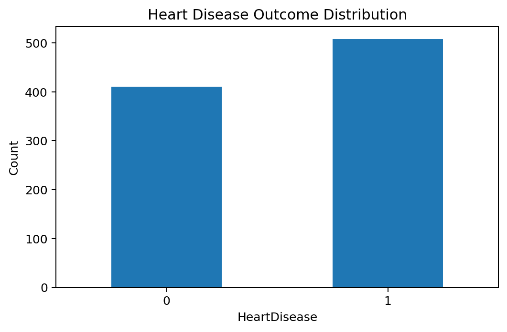
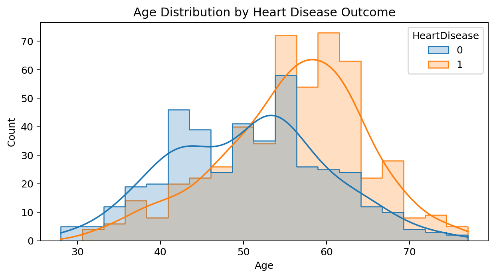
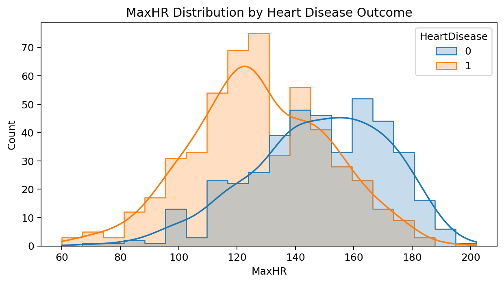
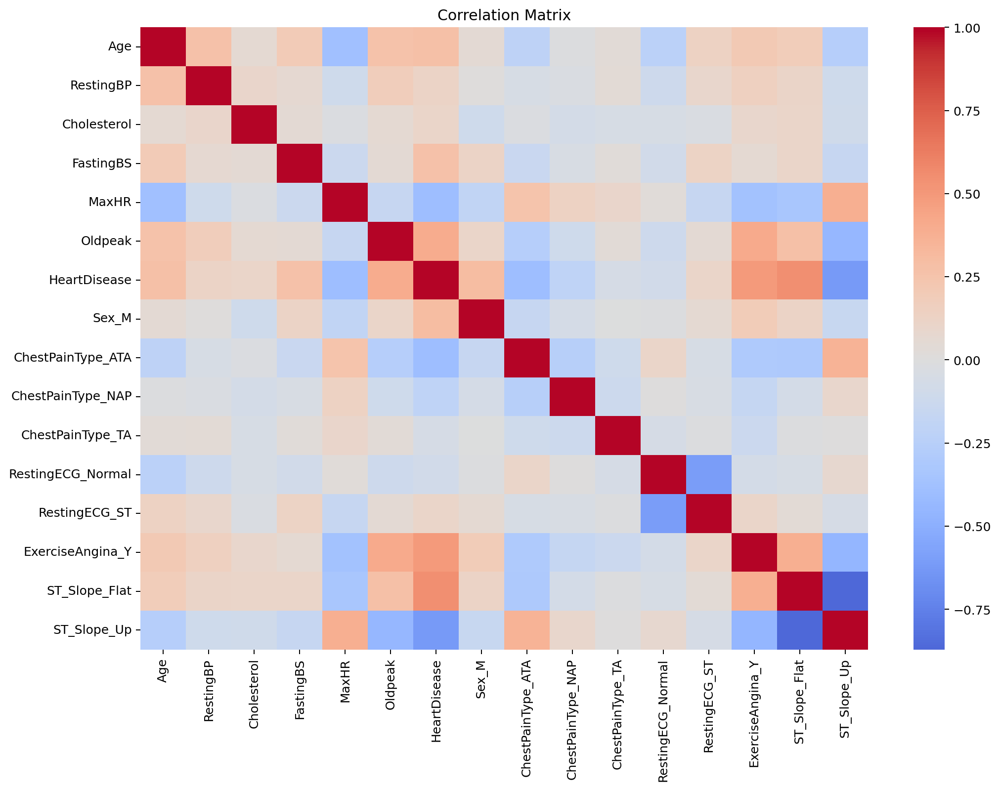
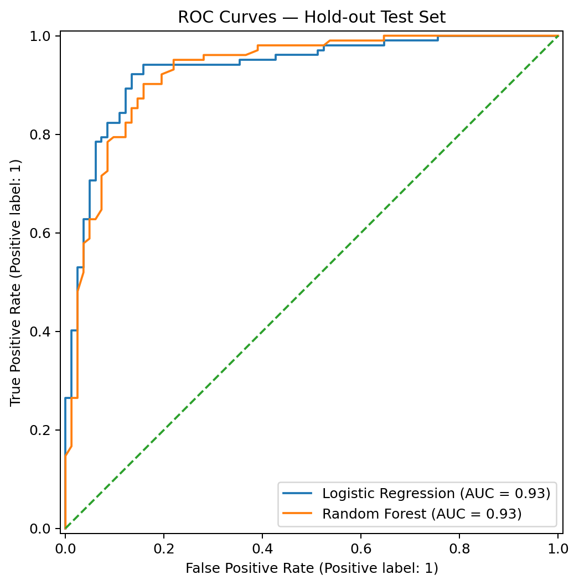
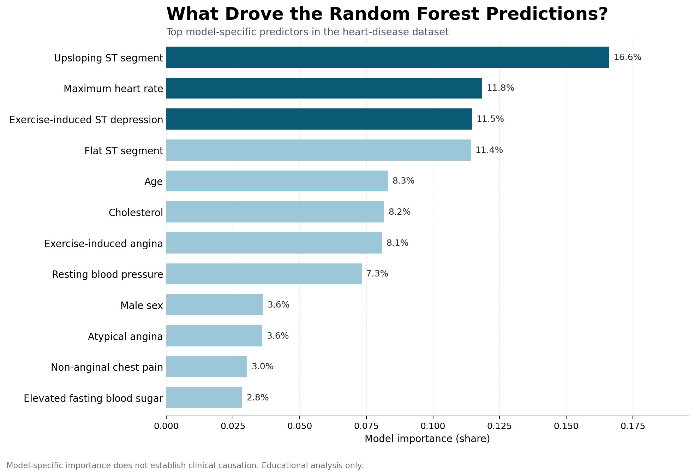
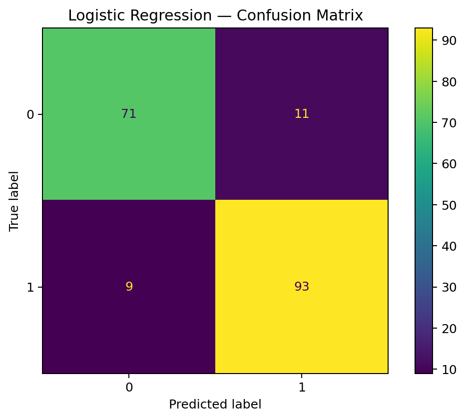
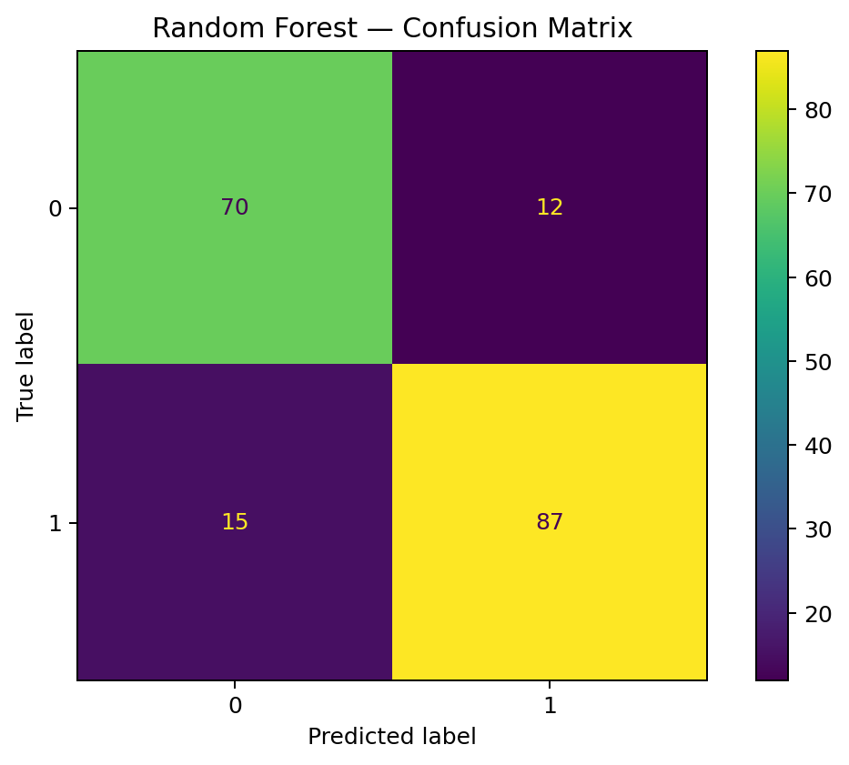

# 🫀 Heart Disease — Exploratory Data Analysis & Risk Modeling

### CardioRisk-AI | Healthcare Data Analysis with Python

A healthcare data science project exploring clinical characteristics associated with heart disease and preparing patient data for predictive modeling.

## 🎯 Project Objective

Move from structured clinical data to clear, reproducible healthcare insights by combining exploratory analysis, preprocessing, visualization, clinical interpretation, and predictive-modeling concepts.

## 🔎 Analysis Pipeline

1. **Data exploration** — inspect structure, variables, distributions, and data quality.
2. **Data preprocessing** — prepare clinical variables for analysis and modeling.
3. **Exploratory data analysis** — investigate relationships between patient characteristics and heart disease.
4. **Clinical interpretation** — translate statistical patterns into understandable healthcare insights.
5. **Predictive modeling** — compare baseline classification approaches for cardiovascular risk prediction.
6. **Model evaluation** — assess classification performance with accuracy, precision, recall, F1, ROC-AUC, confusion matrices, and stratified cross-validation.

## 📈 Visual Analysis

The notebook has been executed and saved with its outputs. Visitors can inspect every result directly on GitHub without running any code.

### Heart-disease outcome distribution

### Clinical-variable distributions by outcome

| Age | Maximum heart rate |
|---|---|
|  |  |

### Correlation matrix

### Model discrimination

### Random Forest feature importance

Feature importance describes how much the fitted model used each variable; it does **not** establish causation or clinical importance by itself.

## 📊 Model Results

The models were assessed on a stratified 20% hold-out test set (184 records).

| Model | Accuracy | Precision | Recall | F1 | ROC-AUC |
|---|---:|---:|---:|---:|---:|
| Logistic Regression | 0.891 | 0.894 | 0.912 | 0.903 | 0.933 |
| Random Forest | 0.853 | 0.879 | 0.853 | 0.866 | 0.928 |

Logistic Regression achieved the strongest hold-out performance in this run. Random Forest remained useful as a nonlinear comparison and for model-specific feature-importance exploration.

### Confusion matrices

| Logistic Regression | Random Forest |
|---|---|
|  |  |

The complete notebook also includes:

- Heart-disease outcome distribution
- Age, resting blood pressure, cholesterol, maximum heart rate, and Oldpeak distributions by outcome
- Correlation matrix and target correlations
- Confusion matrices for Logistic Regression and Random Forest
- Hold-out ROC curves
- Stratified cross-validation results

## 📊 Dataset Features

The processed dataset includes variables such as:

- Age
- Resting blood pressure
- Cholesterol
- Fasting blood sugar
- Maximum heart rate
- ST depression (`Oldpeak`)
- Chest pain type
- Resting ECG
- Exercise-induced angina
- ST slope
- Heart disease outcome

## 🧰 Tech Stack

`Python` · `Pandas` · `NumPy` · `Matplotlib` · `Seaborn` · `Scikit-learn` · `Jupyter / Google Colab`

## 📁 Repository Contents

- [`heart_disease_analysis.ipynb`](./heart_disease_analysis.ipynb) — reproducible EDA and baseline modeling notebook
- [`heart_processed.csv`](./heart_processed.csv) — processed clinical dataset
- [`assets/plots/`](./assets/plots) — exported analytical figures visible without executing the notebook

## 🩺 Clinical Perspective

The project emphasizes interpretation of risk-associated patterns rather than treating model output as a diagnosis. Any predictive model derived from this dataset requires external validation, calibration assessment, and clinical oversight before real-world use.

## ⚠️ Important Note

This project is for **educational and portfolio purposes**. Results should not be interpreted as individual medical advice or used as a substitute for professional clinical judgment.

## 👨‍⚕️ Author

**Dr. Natheer Soliman, MD**  
Healthcare Data Analyst | Clinical Data & AI
